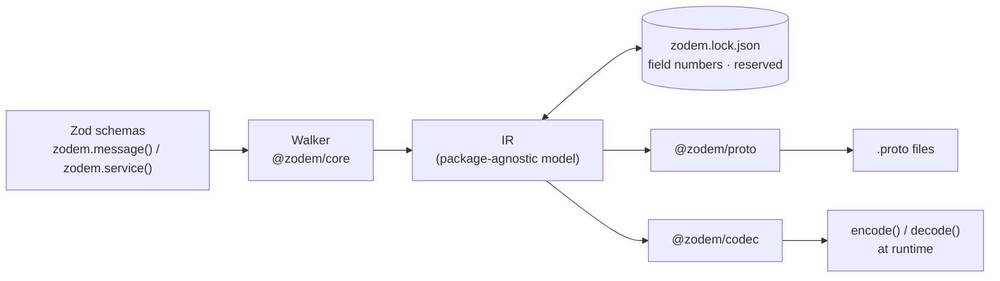

# Zod'em All! 🧢

[English](README.md) | **日本語**

**Zodひとつで、どこでも使える — バックエンド、フロントエンド、そしてAIまで。**

[](https://github.com/asakaxgit/zodem/actions/workflows/ci.yml)
[](https://zod.dev)
[](https://www.typescriptlang.org/)
[](https://nodejs.org)
[](https://pnpm.io)

**zodem**はZod スキーマをそのままワイヤーコントラクトに変換します。`zodem.message()`を一つ書くだけで、
`.proto` ファイル、リファクタしても壊れない安定した protobuf フィールド番号、そしてZod 形式の値と
ワイヤー上のバイト列を相互変換するランタイムコーデックが手に入ります — 同じスキーマが
ブラウザのフォーム *と* サーバーハンドラの両方を検証します。

```bash
pnpm add zod @zodem/core @zodem/proto @zodem/codec
pnpm add -D @zodem/cli
```

---

## 解決する課題

典型的なTypeScript アプリは、同じデータを最低でも 3 回定義しています。

1. **フロントエンドのバリデーション** — フォーム、クライアント側のチェック
2. **フロントエンドとバックエンド間のワイヤーコントラクト** — gRPC / Protobuf
3. **バックエンドのバリデーション** — ハンドラ内のリクエスト検証

編集のたびにこの 3 箇所すべてを手で直し、同期が取れていることを祈ることになります。zodemは
単一のZod スキーマを、この 3 つすべての単一の情報源にします。

> 1 つのZod スキーマ（`CreateUserRequest`）が、このフォーム *と* サーバーのConnect ハンドラの
> 両方を検証します。リクエストは実際のConnect/protobuf ワイヤープロトコルで送られます。
> — [フルスタックの例](#フルスタックの例) から抜粋

## Zodを入れると`.proto`が出てくる

```ts
import { z } from "zod";
import { zodem } from "@zodem/core";

export const User = zodem.message("acme.user.v1.User", {
  id: z.string().uuid(),
  email: z.string().email(),
  age: z.number().int().min(0).max(150).meta({ proto: "int32" }),
  role: z.enum(["admin", "member"]),
  nickname: z.string().optional(),
  address: z.object({ city: z.string(), country: z.string() }),
  createdAt: z.date(),
});
```

`zodem generate`を実行すると、これが次のように変換されます。

```proto
// Code generated by zodem. DO NOT EDIT.
syntax = "proto3";

package acme.user.v1;

import "google/protobuf/timestamp.proto";

message User {
  string id = 1;
  string email = 2;
  int32 age = 3;
  User.Role role = 4;
  optional string nickname = 5;
  User.Address address = 6;
  google.protobuf.Timestamp created_at = 7;
  message Address {
    string city = 1;
    string country = 2;
  }
  enum Role {
    ROLE_UNSPECIFIED = 0;
    ROLE_ADMIN = 1;
    ROLE_MEMBER = 2;
  }
}
```

`User`は依然としてごく普通の`z.object()`です — `User.parse(...)` / `.safeParse(...)`は
これまでと全く同じように動作します。`zodem.message()`は、それに加えてこのスキーマを
protobufのフルネームで登録するだけです。これにより、walkerがこのスキーマへの参照を
解決できるようになります。

## クイックスタート

```ts
// zodem.config.ts
export default {
  entry: ["src/schemas/**/*.ts"],   // zodem.message() / zodem.service() を呼び出すモジュール
  outDir: "proto",                  // 生成された .proto ファイルの出力先
  lockfile: "zodem.lock.json",      // コミットする — フィールド番号を安定させる要
};
```

```bash
npx zodem generate
# wrote 1 proto file(s) and zodem.lock.json
```

`proto/`と`zodem.lock.json`の両方をコミットしてください。以降は、スキーマを変更するたびに
`zodem generate`を実行し、CIでは`zodem generate --check`を実行してコミットし忘れを
検知します。

## 仕組み



Zodの内部実装に触れるのはwalkerだけです（Zod 4が公認するlibrary-author向けAPIである
`_zod.def`を読み取ります）。それより下流の処理 — ロックファイルの同期、`.proto` エミッタ、
コーデック — はすべて同じ素のIRの上で動作します。

## 安定したワイヤー番号を保証する

このロックファイルこそが、実際のワイヤープロトコルとして安全に使える理由です。フィールド番号は
一度だけ、単調増加するカウンタから割り当てられ、二度と動きません。

- **キーの順序は一切関係ありません。** Zod スキーマ内でフィールドをどう並べ替えても、生成される
  `.proto`とロックファイルはバイト単位で同一になります。
- **フィールドの削除は、その番号を永久に予約します。**
  ```proto
  reserved 5;
  reserved "nickname";
  ```
  その後 *新しい* フィールドを追加すると新しい番号が割り当てられます — 削除された番号は、
  同じ名前のフィールドが戻ってきても二度と再利用されません。
- **互換性のない変更は、ワイヤーに黙って書き込まれるのではなく検知されます。** フィールドの型を
  ワイヤー互換性のないものに変更すると、ビルドが失敗します。
  > `Breaking change at User.id: type changed from "string" to "int32", which is not
  > wire-compatible. Remove the field (it becomes reserved) and add a new one instead, or
  > re-run with --allow-breaking to force it.`
  `int32 ↔ int64`、`uint32 ↔ uint64`の拡大や`enum ↔ int32`は許可されます（縮小方向は
  警告になります）。それ以外はすべて`--allow-breaking`か新しいフィールドが必要です。
- **protobufの予約範囲は尊重されます。** `19000–19999`の番号は自動的にスキップされます。

```json
// zodem.lock.json (excerpt)
"acme.user.v1.User": {
  "nextField": 9,
  "fields": {
    "id": { "number": 1, "type": "string", "label": "singular" },
    "role": { "number": 5, "type": "enum:acme.user.v1.User.Role", "label": "singular" }
  },
  "reserved": []
}
```

既存の`.proto` コントラクトに合わせるなど、特定の番号を固定したい場合はどうすればよいでしょうか？
`.meta({ field: 5 })`が抜け道です — ロックファイルと矛盾するピン留めは、黙ってずれていくのではなく
大声でエラーになります。

## ワイヤーを壊さずにリネームする

上記の同期アルゴリズムにとって、単純なリネームは*削除して追加*したように見えます — 古いフィールド
番号は`reserved`に送られ、リネーム後のフィールドはまったく新しい番号を引きます。これは、古い
フィールド名の番号をまだエンコードしているすべてのクライアントを黙って壊してしまいます。
`zodem rename`は、番号を保持したままロックファイルを直接編集します。

```bash
zodem rename field acme.user.v1.User nickname full_name
# renamed acme.user.v1.User.nickname -> full_name in zodem.lock.json
# Next: rename the field in your Zod schema, then run `zodem generate`.

zodem rename message acme.user.v1.User acme.user.v1.Account
# cascades to every nested message, enum, and field type reference

zodem rename enum-value acme.user.v1.User.Role ROLE_MEMBER ROLE_USER
# warning: this rename is wire-compatible but changes the proto JSON encoding for this value.
```

流れ: renameコマンドを実行 → Zod スキーマ内で同じものをリネーム → `zodem generate`。

## CLI リファレンス

```
Usage:
  zodem generate [--check] [--allow-breaking]
  zodem rename field <message> <oldName> <newName>
  zodem rename message <oldFullName> <newFullName>
  zodem rename enum-value <enum> <oldName> <newName>
```

| コマンド | 内容 |
|---|---|
| `zodem generate` | 登録済みスキーマをwalkし、ロックファイルを同期し、`.proto` ファイルを書き出す |
| `zodem generate --check` | 同上だが何も書き込まない。変更が発生する場合は非ゼロで終了する — CIのゲート |
| `zodem generate --allow-breaking` | ワイヤー非互換な変更を許可する（それでもロックファイルには記録される） |
| `zodem rename field <message> <old> <new>` | ロックファイル内のフィールドをリネームし、番号を維持する |
| `zodem rename message <old> <new>` | メッセージをリネームし、入れ子の型とすべての参照に反映する |
| `zodem rename enum-value <enum> <old> <new>` | enumの値をリネームし、番号を維持する |

## 型のマッピング

| Zod | proto3 | 備考 |
|---|---|---|
| `z.string()` | `string` | |
| `z.boolean()` | `bool` | |
| `z.number()` | デフォルトは`double` | `.int()`/`z.int32()` → `int32`（`.min()`/`.max()`の範囲指定がないと警告）。`z.int64()`/`uint32`/`float32`/`float64`はフォーマット指定で |
| `z.bigint()` | デフォルトは`int64` | `uint64`はフォーマット指定で |
| `z.date()` | `google.protobuf.Timestamp` | WKTのimportを追加する |
| `z.unknown()` / `z.any()` | `google.protobuf.Value` | |
| `zodem.bytes()` | `bytes` | サポートされている書き方 — `z.instanceof(Uint8Array)`は拒否される |
| `z.enum([...])` | 入れ子の`enum` | ゼロ値は常に`<ENUM>_UNSPECIFIED = 0` |
| `z.object({...})` | 入れ子の`message` | 無名オブジェクト → `<Parent>.<PascalKey>`、`zodem.message()` → トップレベル参照 |
| `z.array(T)` | `repeated T` | 配列の配列やマップは`<Field>List` ラッパーメッセージを合成する（Zodからは透過的） |
| `z.record(K, V)` | `map<K, V>` | `K`は`string`か整数/bool 系スカラーである必要がある |
| `z.discriminatedUnion(key, [...])` | `oneof` | 各ブランチは兄弟メッセージ `<Parent><PascalCase(value)>`になる |
| `z.lazy(() => Registered)` | 自己参照 | 安定した識別のため、必ず`zodem.message()`に解決される必要がある |
| `.optional()` | proto3 `optional` | |
| `.nullable()` | `google.protobuf.*Value` ラッパー | `null`とabsentはどちらも"not set"にデコードされる |
| `.meta({ proto })` | 推論されたスカラー型を上書きする | 例: `"sint32"`、`"fixed64"` |
| `.meta({ field })` | ワイヤーのフィールド番号を固定する | 既存の`.proto`を取り込むための抜け道 |
| `.meta({ name })` | 入れ子のメッセージ/enum 名を上書きする | |
| `.meta({ validate: false })` | このフィールドのprotovalidate ルールを抑制する | `validate` 設定フラグを上書きする。[バリデーション](#バリデーション) を参照 |

`.nullable()`はwell-knownなラッパー型を持つすべてのスカラー（`string`、`bool`、
`int32`/`int64`、`uint32`/`uint64`、`float`/`double`、`bytes`）をラップします —
`sint*`/`fixed*`にはラッパーが存在しないため、代わりに例外を投げます。

### 意図的にサポートしていないもの

zodemは推測に頼らずエラーを出すため、ワイヤーフォーマットは常に予測可能です。

| 構文 | zodemのメッセージ |
|---|---|
| `z.union()` | `plain z.union() has no proto equivalent; use z.discriminatedUnion() instead` |
| `z.intersection()` | `z.intersection() is not supported; merge the shapes manually with z.object({ ...a.shape, ...b.shape })` |
| `z.tuple()` | `z.tuple() is not supported; use z.array() or separate fields` |
| `z.map()` | `z.map() is not supported; model it as z.array(z.object({ key, value }))` |
| `z.set()` | `z.set() is not supported; use z.array() with application-level uniqueness` |
| `z.function()` | `z.function() has no proto equivalent` |
| `z.promise()` | `z.promise() has no proto equivalent; unwrap it before passing to zodem.message()` |
| `z.instanceof()` / custom | `use zodem.bytes() for Uint8Array fields` |

## スカラーを超えて

**discriminated unionは`oneof`になります:**

```ts
const Circle = z.object({ kind: z.literal("circle"), radius: z.number() });
const Square = z.object({ kind: z.literal("square"), side: z.number() });
zodem.message("acme.user.v1.Container", {
  shape: z.discriminatedUnion("kind", [Circle, Square]),
});
```

```proto
message Container {
  oneof shape {
    Container.ShapeCircle circle = 1;
    Container.ShapeSquare square = 2;
  }
  message ShapeCircle { double radius = 1; }
  message ShapeSquare { double side = 1; }
}
```

ランタイムでは、コーデックがprotobuf-esのネイティブな`{ case, value }` ADTを代わりに扱います。
`{ shape: { kind: "circle", radius: 5 } }` ↔ `{ shape: { case: "circle", value: { radius: 5 } } }`

**入れ子のコレクションは透過的なラッパーメッセージになります。** proto3は`repeated repeated T`を
禁止しているため、`z.array(z.array(z.string()))`は`repeated MatrixList matrix`になり、ワイヤー上
には 1 フィールドの合成メッセージが乗ります — しかしコーデックはそれを完全に隠します。
`{ matrix: [["a","b"],["c"]] }` ↔ `{ matrix: [{ values: ["a","b"] }, { values: ["c"] }] }`
デコード時にはプレーンな入れ子配列がそのまま返ってきます。

**`z.lazy()`による再帰型**。ただし再帰する型が登録済みの`zodem.message()`であることが
条件です。

```ts
export const Category = zodem.message("acme.cat.v1.Category", {
  name: z.string(),
  children: z.array(z.lazy(() => Category)),
});
```

## バリデーション

Zodのチェック（`.min()`、`.email()`、`.uuid()`、`.regex()`など）は常にスキーマから読み取られ
IRに載ります — `zodem.config.ts`で`validate`を有効にすると、それらを
[protovalidate](https://protovalidate.com/)の`buf.validate` フィールドオプションとしても
出力できます。これにより、TypeScript 以外のバックエンドも、ワイヤー形状だけでなくZod スキーマが
強制しているのと同じルールを受け取れます。

```ts
// zodem.config.ts
export default {
  entry: ["src/schemas/**/*.ts"],
  outDir: "proto",
  lockfile: "zodem.lock.json",
  validate: true,
};
```

```ts
export const User = zodem.message("acme.user.v1.User", {
  id: z.string().uuid(),
  email: z.string().email(),
  displayName: z.string().min(1).max(100),
  age: z.number().int().min(0).max(150).meta({ proto: "int32" }),
});
```

```proto
message User {
  string id = 1 [(buf.validate.field).string = {uuid: true}];
  string email = 2 [(buf.validate.field).string = {email: true}];
  string display_name = 3 [(buf.validate.field).string = {min_len: 1, max_len: 100}];
  int32 age = 4 [(buf.validate.field).int32 = {gte: 0, lte: 150}];
}
```

`validate`は**デフォルトでオフ**です — 明示的に有効化しない限り、生成される出力はバイト単位で
同一のままです。そしてこれはプロジェクト単位ではなくフィールド単位の設定です。`.meta({ validate:
false })`は、設定フラグがオンであっても、そのフィールドだけルールを抑制します。

| Zodチェック | protovalidateルール |
|---|---|
| 文字列への`.min(n)` / `.max(n)` / `.length(n)` | `string.min_len` / `max_len` / `len` |
| `.email()` / `.uuid()` / `.guid()` / `.url()` / `.ipv4()` / `.ipv6()` | `string.email` / `uuid` / `uuid` / `uri` / `ipv4` / `ipv6` |
| `.regex(re)` | `string.pattern`（パターン本体のみ — フラグは表現できない） |
| `.startsWith()` / `.endsWith()` / `.includes()` | `string.prefix` / `suffix` / `contains` |
| number/bigintへの`.gt()` / `.gte()` / `.lt()` / `.lte()` | 対応する数値ルールグループの`gt`/`gte`/`lt`/`lte` |
| 配列への`.min(n)` / `.max(n)` | `repeated.min_items` / `max_items`。加えて要素自体のルールが`items`に入れ子になる |

この表にないもの（`.datetime()`、`.cuid()`、カスタムの`.refine()`など）は、推測せずに単純に
スキップされます — ルールがフィールド番号や型解決に影響することは一切ないため、ワイヤー形状は
どちらにせよ変わりません。

`buf.validate.field`は別のスキーマ — `buf/validate/validate.proto` — に由来し、あなたの
`.proto`出力はこれをimportするようになります。[フルスタックの例](#フルスタックの例)では
これをベンダリングしているため（`examples/fullstack/shared/proto/buf/validate/validate.proto`）、
`buf lint`/`buf build`とCIはBSRに一切アクセスする必要がありません。自分のコピーが欲しい場合は
`buf export buf.build/bufbuild/protovalidate`で取得できます。

## ランタイムコーデック

`@zodem/codec`は、同じロック同期済みのIRから直接encode/decode 関数を構築します —
生成されたprotobuf-esコードへの依存はありません。

```ts
import { walkRegistry } from "@zodem/core";
import { createCodecs } from "@zodem/codec";

const codecs = createCodecs(walkRegistry().messages);
const codec = codecs.get("acme.user.v1.User")!;

const wire = codec.encode(userValue);   // Zod value -> plain object for protobuf-es
const back = codec.decode(wire);        // -> Zod-shaped value again
```

enumの文字列 ↔ 数値、`Date` ↔ `Timestamp`、`null` ↔ ラッパー型の"not set"、
`oneof` ↔ `{ case, value }`、そして上記のリストラッパーの展開まで扱います — 実際のワイヤー
バイト列を介したラウンドトリップで検証済みです。

```ts
const protoMessage = create(CreateUserRequestSchema, codec.encode(parsed) as never);
const bytes = toBinary(CreateUserRequestSchema, protoMessage);
const decoded = codec.decode(fromBinary(CreateUserRequestSchema, bytes) as never);
expect(decoded).toEqual(parsed); // ✅
```

## サービス

```ts
export const UserService = zodem.service("acme.user.v1.UserService", {
  createUser: { input: CreateUserRequest, output: CreateUserResponse },
  getUser: { input: GetUserRequest, output: GetUserResponse },
  // listUsers: { input: ..., output: ..., stream: "server" }  // "client" | "bidi" too
});
```

```proto
service UserService {
  rpc CreateUser(CreateUserRequest) returns (CreateUserResponse) {}
  rpc GetUser(GetUserRequest) returns (GetUserResponse) {}
}
```

入出力メッセージの名前は`<Method>Request` / `<Method>Response`である必要があります —
これは生成時にbufの標準RPC 命名lint ルールに照らしてチェックされるため、生成物が
`buf lint`で失敗することはありません。

## フルスタックの例

`examples/fullstack/`は、上記の`User` スキーマの上に構築された、実際に動く 3 パッケージ構成の
アプリです。

- **`@example/shared`** — Zod スキーマ、生成された`.proto`、`protoc-gen-es`の出力、
  そしてコーデックのブートストラップ
- **`@example/server`** — `node:http`上で動く[Connect](https://connectrpc.com/)サーバー。
  リクエストをコーデックでデコードし、*同じ*`zod.CreateUserRequest`で検証する
- **`@example/web`** — React + Vite クライアント。同じスキーマでフォームを検証してから、
  実際のConnect/protobuf リクエストを送信する

```bash
pnpm example:generate   # 共有スキーマから proto/ とロックファイルを再生成する
pnpm example:dev        # サーバーと web アプリを同時に起動する
```

## 規約だけでなくCIで強制する

```yaml
# .github/workflows/ci.yml
- run: pnpm run example:generate:check
- run: pnpm run example:buf:lint
- run: pnpm run example:buf:breaking  # optional: reports wire-breaking drift, doesn't block
```

> スキーマは変更されたのに`proto/`やロックファイルが再生成・コミットされていない場合、
> ビルドを失敗させます — これがこのプロジェクトの売りそのものなので、CIで実際に強制しています。
> `buf breaking`はすべてのPRで`main`に対して実行される非ブロッキングのチェックです —
> マージをゲートすることなく、ワイヤー互換性のドリフトを報告します。

## パッケージ

| パッケージ | 役割 |
|---|---|
| [`@zodem/core`](packages/core) | `zodem.message()` / `zodem.service()`、Zod → IRのwalker、ロックファイルエンジン（採番、ワイヤー互換性チェック、リネーム）。ブラウザ安全なメインエントリと、ロックファイルのディスクI/O 用の`/node` サブパスを提供する。 |
| [`@zodem/proto`](packages/proto) | 純粋なIR → `.proto` テキストエミッタ。決定的な出力、複数パッケージのimportに対応。 |
| [`@zodem/codec`](packages/codec) | Zodの値とprotobuf-esオブジェクトの間を変換する、ランタイムかつIR駆動のコーデック。 |
| [`@zodem/cli`](packages/cli) | `zodem`バイナリ — `generate`と`rename`、設定の読み込み。 |

## ロードマップ

| | 状態 |
|---|---|
| Zod → `.proto` ジェネレータ、スカラー/オブジェクト/enum/配列/optional、`generate --check` | ✅ 完了 |
| フィールド・メッセージ・enum 値の`zodem rename` | ✅ 完了 |
| マップ、`z.lazy()` 再帰、コレクションラッパーメッセージ、複数パッケージ出力 | ✅ 完了 |
| `zodem.service()` → `service`/`rpc`、ストリーミング、Connect コーデック | ✅ 完了 |
| 削除された型のトゥームストーン化、任意のCI チェックとしての`buf breaking` | ✅ 完了 |
| Zodのチェック（`min`、`email`、`regex`など）からの`buf.validate`（protovalidate）アノテーション出力 | ✅ 完了 |
| **同じIRからのJSON Schema / LLM tool-call・構造化出力エミッション** | ⬜ 計画中 |
| **`zodem-form` — 同じIRからフォームスキーマ（フィールドと制約）を生成する** | ⬜ 計画中 |

最後の 2 行はどちらも、同じwalker/IRの新しい消費者です — `@zodem/proto`や`@zodem/codec`と
同様に、どちらもまだ実装されていません。JSON Schema/LLMの行は、冒頭のタグラインにある"AI"の
部分です。`zodem-form`の行は、Phase 5のprotovalidate ルール収集（`IRField.rules`）をほぼ
そのまま再利用できます — フォームのフィールド制約（必須、min/max、パターン、email/uuid形式など）
は、ほとんど同じ情報だからです。

## 開発

```bash
pnpm install
pnpm build
pnpm test
pnpm typecheck
pnpm lint
```

テストは[Vitest](https://vitest.dev/)上で実行されます。CLIのテストスイートは、ライブラリを
プロセス内から呼び出すのではなく、実際にビルドされた`zodem`バイナリを子プロセスとして起動します
— これにより、テストされる内容が実際の呼び出しと完全に一致します。生成された`.proto`出力は、
同じテストスイート内でさらに`buf lint`と`buf build`によっても検証されます。

## ライセンス

未定。
