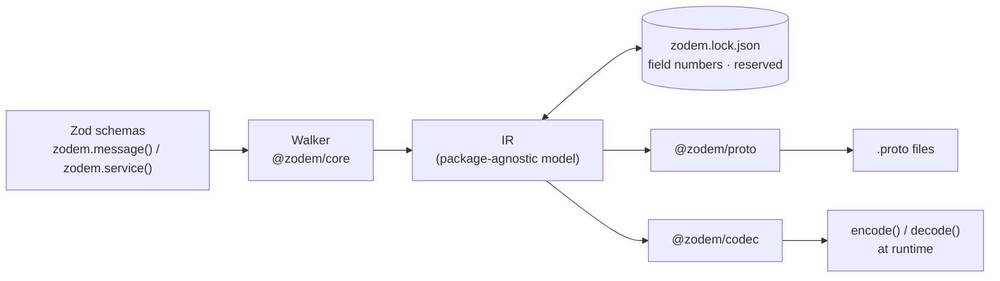

# Zod'em All! 🧢

**Write Zod once. Use it everywhere — backend, frontend, and AI.**

[](https://github.com/asakaxgit/zodem/actions/workflows/ci.yml)
[](https://zod.dev)
[](https://www.typescriptlang.org/)
[](https://nodejs.org)
[](https://pnpm.io)

**zodem** turns a Zod schema into your wire contract. Write one `zodem.message()`, and it
becomes a `.proto` file, a stable protobuf field number that survives refactors, and a runtime
codec that translates between your Zod-shaped values and the bytes on the wire — so the exact
same schema validates a browser form *and* a server handler.

```bash
pnpm add zod @zodem/core @zodem/proto @zodem/codec
pnpm add -D @zodem/cli
```

---

## The problem

A typical TypeScript app defines the same piece of data at least three times:

1. **Frontend validation** — forms, client-side checks
2. **The wire contract** between frontend and backend — gRPC / Protobuf
3. **Backend validation** — request validation in handlers

Every edit means touching all three, by hand, and hoping they stay in sync. zodem makes a
single Zod schema the source of truth for all three instead:

> One Zod schema (`CreateUserRequest`) validates this form *and* the server's Connect handler.
> The request goes over the real Connect/protobuf wire protocol.
> — copy from the [full-stack example](#the-full-stack-example)

## Zod in, `.proto` out

```ts
import { z } from "zod";
import { zodem } from "@zodem/core";

export const User = zodem.message("acme.user.v1.User", {
  id: z.string().uuid(),
  email: z.string().email(),
  age: z.number().int().min(0).max(150).meta({ proto: "int32" }),
  role: z.enum(["admin", "member"]),
  nickname: z.string().optional(),
  address: z.object({ city: z.string(), country: z.string() }),
  createdAt: z.date(),
});
```

`zodem generate` turns that into:

```proto
// Code generated by zodem. DO NOT EDIT.
syntax = "proto3";

package acme.user.v1;

import "google/protobuf/timestamp.proto";

message User {
  string id = 1;
  string email = 2;
  int32 age = 3;
  User.Role role = 4;
  optional string nickname = 5;
  User.Address address = 6;
  google.protobuf.Timestamp created_at = 7;
  message Address {
    string city = 1;
    string country = 2;
  }
  enum Role {
    ROLE_UNSPECIFIED = 0;
    ROLE_ADMIN = 1;
    ROLE_MEMBER = 2;
  }
}
```

`User` is still a completely normal `z.object()` — `User.parse(...)` / `.safeParse(...)` work
exactly as before. `zodem.message()` just also registers the schema by its full protobuf name
so the walker can resolve references to it.

## Quickstart

```ts
// zodem.config.ts
export default {
  entry: ["src/schemas/**/*.ts"],   // modules that call zodem.message() / zodem.service()
  outDir: "proto",                  // where generated .proto files land
  lockfile: "zodem.lock.json",      // committed — this is what keeps field numbers stable
};
```

```bash
npx zodem generate
# wrote 1 proto file(s) and zodem.lock.json
```

Commit both `proto/` and `zodem.lock.json`. From here, run `zodem generate` on every schema
change, and `zodem generate --check` in CI to catch anyone who forgot.

## How it works



Only the walker touches Zod internals (it reads Zod 4's sanctioned `_zod.def` library-author
surface); everything downstream — the lockfile sync, the `.proto` emitter, the codec — works
on the same plain IR.

## Stable wire numbers, guaranteed

The lockfile is what makes this safe to use for a real wire protocol: field numbers are
assigned once, from a monotonic counter, and never move.

- **Key order never matters.** Reorder every field in the Zod schema — the generated `.proto`
  and lockfile are byte-identical.
- **Deleting a field reserves its number, forever.**
  ```proto
  reserved 5;
  reserved "nickname";
  ```
  Add a *new* field afterwards and it gets a fresh number — a removed number is never recycled,
  even by a field with the same name coming back.
- **Incompatible changes are caught, not silently written to the wire.** Changing a field's
  type to something that isn't wire-compatible fails the build:
  > `Breaking change at User.id: type changed from "string" to "int32", which is not
  > wire-compatible. Remove the field (it becomes reserved) and add a new one instead, or
  > re-run with --allow-breaking to force it.`
  `int32 ↔ int64`, `uint32 ↔ uint64` widening and `enum ↔ int32` are allowed (narrowing warns);
  everything else needs `--allow-breaking` or a new field.
- **The protobuf-reserved range is respected.** Numbers `19000–19999` are skipped automatically.

```json
// zodem.lock.json (excerpt)
"acme.user.v1.User": {
  "nextField": 9,
  "fields": {
    "id": { "number": 1, "type": "string", "label": "singular" },
    "role": { "number": 5, "type": "enum:acme.user.v1.User.Role", "label": "singular" }
  },
  "reserved": []
}
```

Need to pin a specific number, e.g. to match an existing `.proto` contract?
`.meta({ field: 5 })` is the escape hatch — a pin that disagrees with the lockfile fails loudly
instead of silently drifting.

## Renaming without breaking the wire

A plain rename looks like *delete + add* to the sync algorithm above — the old field number
would go to `reserved` and the renamed field would draw a brand new one, silently breaking
every client still encoding the old field name's number. `zodem rename` edits the lockfile
directly instead, keeping the number:

```bash
zodem rename field acme.user.v1.User nickname full_name
# renamed acme.user.v1.User.nickname -> full_name in zodem.lock.json
# Next: rename the field in your Zod schema, then run `zodem generate`.

zodem rename message acme.user.v1.User acme.user.v1.Account
# cascades to every nested message, enum, and field type reference

zodem rename enum-value acme.user.v1.User.Role ROLE_MEMBER ROLE_USER
# warning: this rename is wire-compatible but changes the proto JSON encoding for this value.
```

Workflow: run the rename command → rename the same thing in the Zod schema → `zodem generate`.

## CLI reference

```
Usage:
  zodem generate [--check] [--allow-breaking]
  zodem rename field <message> <oldName> <newName>
  zodem rename message <oldFullName> <newFullName>
  zodem rename enum-value <enum> <oldName> <newName>
```

| Command | What it does |
|---|---|
| `zodem generate` | Walk the registered schemas, sync the lockfile, write `.proto` files |
| `zodem generate --check` | Same, but writes nothing; exits non-zero if anything would change — the CI gate |
| `zodem generate --allow-breaking` | Permit a wire-incompatible change (still recorded in the lockfile) |
| `zodem rename field <message> <old> <new>` | Rename a field in the lockfile, keeping its number |
| `zodem rename message <old> <new>` | Rename a message, cascading to nested types and every reference |
| `zodem rename enum-value <enum> <old> <new>` | Rename an enum value, keeping its number |

## Type mapping

| Zod | proto3 | Notes |
|---|---|---|
| `z.string()` | `string` | |
| `z.boolean()` | `bool` | |
| `z.number()` | `double` by default | `.int()`/`z.int32()` → `int32` (warns without `.min()`/`.max()` bounds); `z.int64()`/`uint32`/`float32`/`float64` via format |
| `z.bigint()` | `int64` by default | `uint64` via format |
| `z.date()` | `google.protobuf.Timestamp` | adds the WKT import |
| `z.unknown()` / `z.any()` | `google.protobuf.Value` | |
| `zodem.bytes()` | `bytes` | the supported spelling — `z.instanceof(Uint8Array)` is rejected |
| `z.enum([...])` | nested `enum` | zero value is always `<ENUM>_UNSPECIFIED = 0` |
| `z.object({...})` | nested `message` | anonymous → `<Parent>.<PascalKey>`; `zodem.message()` → top-level reference |
| `z.array(T)` | `repeated T` | array-of-array/map synthesizes a `<Field>List` wrapper message (transparent to Zod) |
| `z.record(K, V)` | `map<K, V>` | `K` must be `string` or an integral/bool scalar |
| `z.discriminatedUnion(key, [...])` | `oneof` | each branch → sibling message `<Parent><PascalCase(value)>` |
| `z.lazy(() => Registered)` | self-reference | must resolve to a `zodem.message()` for stable identity |
| `.optional()` | proto3 `optional` | |
| `.nullable()` | `google.protobuf.*Value` wrapper | `null` and absent both decode to "not set" |
| `.meta({ proto })` | override the inferred scalar | e.g. `"sint32"`, `"fixed64"` |
| `.meta({ field })` | pin the wire field number | escape hatch for importing an existing `.proto` |
| `.meta({ name })` | override a nested message/enum name | |

`.nullable()` wraps every scalar that has a well-known wrapper type (`string`, `bool`,
`int32`/`int64`, `uint32`/`uint64`, `float`/`double`, `bytes`) — `sint*`/`fixed*` have none and
throw instead.

### Unsupported on purpose

zodem errors instead of guessing, so the wire format is always predictable:

| Construct | zodem's message |
|---|---|
| `z.union()` | `plain z.union() has no proto equivalent; use z.discriminatedUnion() instead` |
| `z.intersection()` | `z.intersection() is not supported; merge the shapes manually with z.object({ ...a.shape, ...b.shape })` |
| `z.tuple()` | `z.tuple() is not supported; use z.array() or separate fields` |
| `z.map()` | `z.map() is not supported; model it as z.array(z.object({ key, value }))` |
| `z.set()` | `z.set() is not supported; use z.array() with application-level uniqueness` |
| `z.function()` | `z.function() has no proto equivalent` |
| `z.promise()` | `z.promise() has no proto equivalent; unwrap it before passing to zodem.message()` |
| `z.instanceof()` / custom | `use zodem.bytes() for Uint8Array fields` |

## Beyond scalars

**Discriminated unions become `oneof`:**

```ts
const Circle = z.object({ kind: z.literal("circle"), radius: z.number() });
const Square = z.object({ kind: z.literal("square"), side: z.number() });
zodem.message("acme.user.v1.Container", {
  shape: z.discriminatedUnion("kind", [Circle, Square]),
});
```

```proto
message Container {
  oneof shape {
    Container.ShapeCircle circle = 1;
    Container.ShapeSquare square = 2;
  }
  message ShapeCircle { double radius = 1; }
  message ShapeSquare { double side = 1; }
}
```

At runtime the codec speaks protobuf-es's native `{ case, value }` ADT for you:
`{ shape: { kind: "circle", radius: 5 } }` ↔ `{ shape: { case: "circle", value: { radius: 5 } } }`.

**Nested collections get transparent wrapper messages.** proto3 forbids `repeated repeated T`,
so `z.array(z.array(z.string()))` becomes `repeated MatrixList matrix` with a synthesized
one-field message on the wire — but the codec hides it completely:
`{ matrix: [["a","b"],["c"]] }` ↔ `{ matrix: [{ values: ["a","b"] }, { values: ["c"] }] }`,
and decoding gives you the plain nested array back.

**Recursive types via `z.lazy()`**, as long as the recursive type is a registered
`zodem.message()`:

```ts
export const Category = zodem.message("acme.cat.v1.Category", {
  name: z.string(),
  children: z.array(z.lazy(() => Category)),
});
```

## Runtime codec

`@zodem/codec` builds encode/decode functions directly from the same lock-synced IR — no
dependency on generated protobuf-es code:

```ts
import { walkRegistry } from "@zodem/core";
import { createCodecs } from "@zodem/codec";

const codecs = createCodecs(walkRegistry().messages);
const codec = codecs.get("acme.user.v1.User")!;

const wire = codec.encode(userValue);   // Zod value -> plain object for protobuf-es
const back = codec.decode(wire);        // -> Zod-shaped value again
```

It handles enum string ↔ number, `Date` ↔ `Timestamp`, `null` ↔ wrapper-type "not set",
`oneof` ↔ `{ case, value }`, and the list-wrapper unwrapping above — verified with a real
round-trip through actual wire bytes:

```ts
const protoMessage = create(CreateUserRequestSchema, codec.encode(parsed) as never);
const bytes = toBinary(CreateUserRequestSchema, protoMessage);
const decoded = codec.decode(fromBinary(CreateUserRequestSchema, bytes) as never);
expect(decoded).toEqual(parsed); // ✅
```

## Services

```ts
export const UserService = zodem.service("acme.user.v1.UserService", {
  createUser: { input: CreateUserRequest, output: CreateUserResponse },
  getUser: { input: GetUserRequest, output: GetUserResponse },
  // listUsers: { input: ..., output: ..., stream: "server" }  // "client" | "bidi" too
});
```

```proto
service UserService {
  rpc CreateUser(CreateUserRequest) returns (CreateUserResponse) {}
  rpc GetUser(GetUserRequest) returns (GetUserResponse) {}
}
```

Method input/output messages must be named `<Method>Request` / `<Method>Response` — enforced
at generation time against buf's standard RPC naming lint rules, so the output never fails
`buf lint` for you.

## The full-stack example

`examples/fullstack/` is a real, running three-package app built on the `User` schema above:

- **`@example/shared`** — the Zod schemas, the generated `.proto`, `protoc-gen-es` output, and
  the codec bootstrap
- **`@example/server`** — a [Connect](https://connectrpc.com/) server on `node:http`,
  decoding requests with the codec and validating with the *same* `zod.CreateUserRequest`
- **`@example/web`** — a React + Vite client that validates the form with that same schema
  before sending a real Connect/protobuf request

```bash
pnpm example:generate   # regenerate proto/ + the lockfile from the shared schemas
pnpm example:dev        # run the server and the web app together
```

## CI enforces it, not just convention

```yaml
# .github/workflows/ci.yml
- run: pnpm run example:generate:check
- run: pnpm run example:buf:lint
- run: pnpm run example:buf:breaking  # optional: reports wire-breaking drift, doesn't block
```

> Fails the build if the schemas changed but `proto/` or the lockfile weren't regenerated and
> committed — this is the guarantee the whole project sells, so CI is where it's actually
> enforced. `buf breaking` runs on every PR against `main` as a non-blocking check — it reports
> wire compatibility drift without gating the merge.

## Packages

| Package | Purpose |
|---|---|
| [`@zodem/core`](packages/core) | `zodem.message()` / `zodem.service()`, the Zod → IR walker, the lockfile engine (allocation, wire-compat checks, renames). Ships a browser-safe main entry plus a `/node` subpath for lockfile disk I/O. |
| [`@zodem/proto`](packages/proto) | Pure IR → `.proto` text emitter, deterministic output, multi-package imports. |
| [`@zodem/codec`](packages/codec) | Runtime, IR-driven codec between Zod values and protobuf-es objects. |
| [`@zodem/cli`](packages/cli) | The `zodem` binary — `generate` and `rename`, config loading. |

## Roadmap

| | Status |
|---|---|
| Zod → `.proto` generator, scalars/objects/enums/arrays/optionals, `generate --check` | ✅ shipped |
| `zodem rename` for fields, messages, enum values | ✅ shipped |
| Maps, `z.lazy()` recursion, collection wrapper messages, multi-package output | ✅ shipped |
| `zodem.service()` → `service`/`rpc`, streaming, Connect codec | ✅ shipped |
| Removed-type tombstoning, `buf breaking` as an optional CI check | ✅ shipped |
| Emit `buf.validate` (protovalidate) annotations from Zod checks (`min`, `email`, `regex`, …) | ⬜ planned |
| **JSON Schema / LLM tool-call & structured-output emission from the same IR** | ⬜ planned |

That last row is the "AI" in the tagline above: the walker already turns a Zod schema into a
package-agnostic IR — an LLM-tool-schema emitter is one more consumer of it, the same way
`@zodem/proto` and `@zodem/codec` are today. It hasn't been built yet.

## Development

```bash
pnpm install
pnpm build
pnpm test
pnpm typecheck
pnpm lint
```

Tests run on [Vitest](https://vitest.dev/); the CLI suite spawns the actual built `zodem`
binary rather than calling into the library in-process, so what's tested is exactly what a
real invocation does. Generated `.proto` output is additionally checked against `buf lint`
and `buf build` in the same suite.

## License

TBD.
